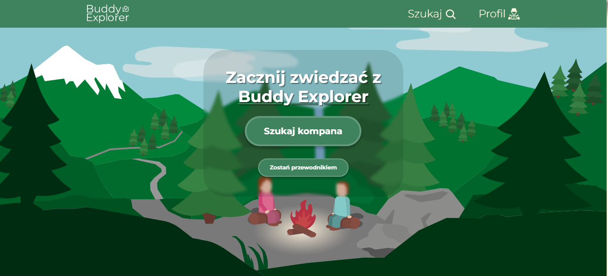
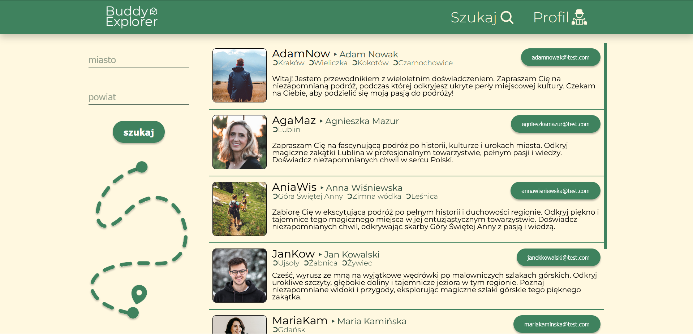
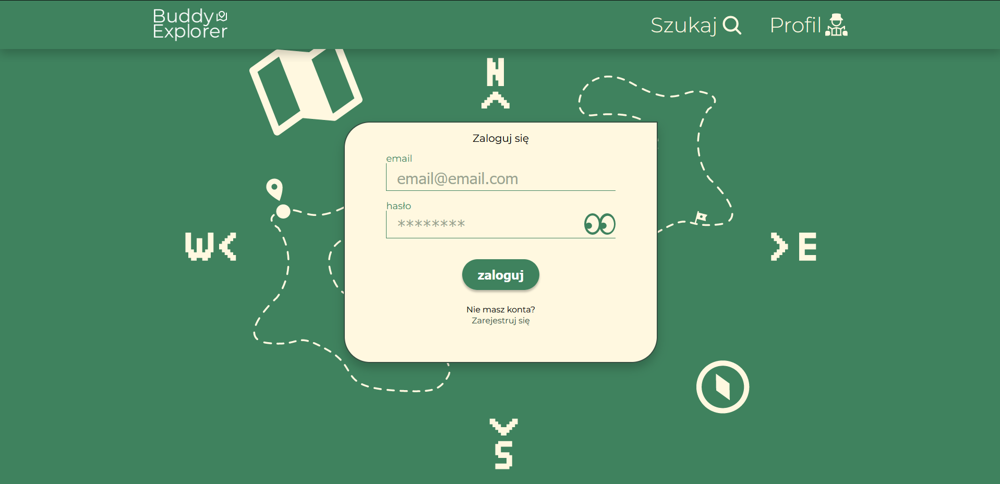
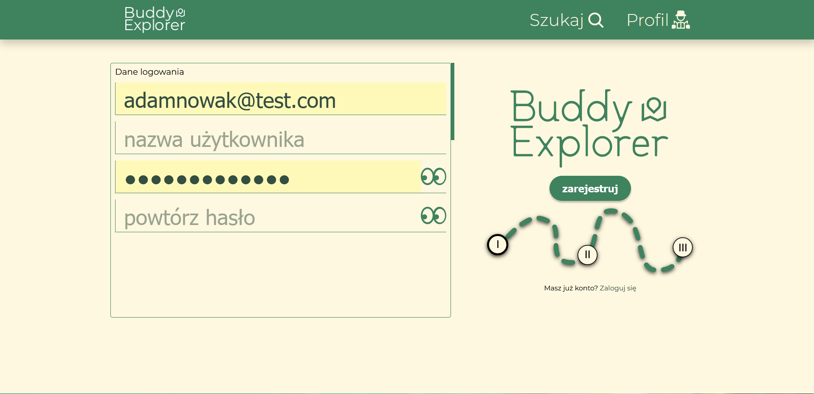
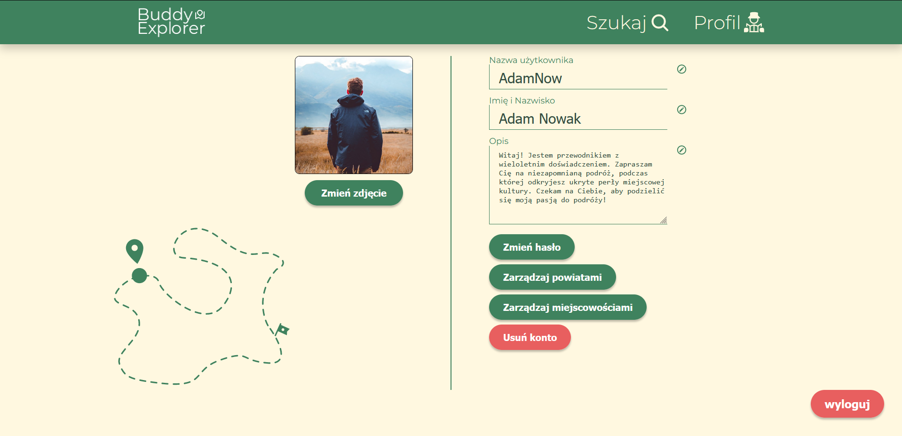

# Buddy Explorer - Find your buddy to explore Poland together

- [Overview](#overview)
  - [About the website](#about-the-website)
- [Technical informations](#technical-informations)
  - [Built with](#built-with)
  - [Features](#features)
  - [Installation Guide](#installation-guide)
- [My process](#my-process)
  - [Step By Step](#step-by-step)
  - [Continued development](#continued-development)
- [Author](#author)

## Overview

### About the website

Buddy Explorer is a website created for travelers who like to explore together with a guide.
The registration is open and everybody can sign up as a guide to appear in the search results.
The website consists of following pages:

| NAME        | PICTURE                          |
| ----------- | -------------------------------- |
| **Home**    |  |
| **Search**  |    |
| **Sign-In** |    |
| **Sign-Up** |    |
| **Profile** |   |

## Technical informations

### Built with

HTML5 + **EJS**,

CSS + **SASS**,

**JavaScript**:

- server - NodeJS, ExpressJS
- Middlewares and Tools:
  - body-parser (parse request bodies),
  - express-validator (validating forms),
  - bcrypt.js (save password usage),
  - multer (handling multipart/form-data),
  - cookie-session (storing logged in user data),
  - clipboard (to ease copying to clipboard on different devices),
  - dotenv (store data for server),
- devTools - Nodemon, Livereload(+Connect-Livereload),

**Database**:

- SQL + XAMPP & PHPMyAdmin

**Design**:

- Figma
- Adobe Illustrator (home page and loading page illustrations are not made by me, I have made only few adjustements in those)
- SVG inline styling

**Applications used**:

- Visual Studio Code,
- XAMPP, phpMyAdmin,
- Postman,
- Figma, Adobe Photoshop, Adobe Illustrator,
- Firefox Developer Edition & Google Chrome dev tools,

### Features

- **Data validation**:

  - All input fields are secured by validators using express-validator middleware

- **User registration**:
  - a user can register as a guide in an interactive(add or remove input fields) 3 step form, with built in progress tracker
  - after registration the user can log in and update his data, add description and upload own profile picture (all user data including profile pictures is stored directly in the sql database.)
- **Database search**:
  - allows all users to search and filter guides by their city and county
  - offers responsive autocomplete name suggestions in city and county input fields
  - database contains a list of polish cities and counties (i used a free to use database, unfortunantly some data in it is incorrect and is not connected city-county, so i had to use 2 seperate lists from which i have excluded repeated names)

### Installation Guide

- Download and unpack the BE_Release.zip
- Update the .env file
- Using XAMP:
  - Create database named "buddy_explorer" and import the buddy_explorer.sql
  - Create a user with values corresponding to .env file, with all privilages to the buddy_explorer database
- Open the buddy_explorer folder in chosen code editor
- Run "npm install"
- To launch the application run Apache and SQL on XAMPP and then run "npm run dev" in the terminal
  - If the installation process was succesfull the console should print messages "listening; db connected;"
  - Application is available in the browser at localhost/[.env PORT]

### Installation Guide

- Download and unpack the BE_Release.zip
- Update the .env file
- Using XAMP:
  - Create database named "buddy_explorer" and import the buddy_explorer.sql
  - Create a user with values corresponding to .env file, with all privilages to the buddy_explorer database
- Open the buddy_explorer folder in chosen code editor
- Run "npm install"
- To launch the application run Apache and SQL on XAMPP and then run "npm run dev" in the terminal
  - If the installation process was succesfull the console should print messages "listening; db connected;"
  - Application is available in the browser at localhost/[.env PORT]

## My Process

### Step By Step

This was my first own project using Express and I'm glad that I have managed to complete it.
I first started of writing down ideas, and features that I would like to implement in my project.
Then I began to code all the features - registration, connecting to database, autocompletion etc. with rough ejs templates with little to no styling.
After that I have designed all pages in Figma both for mobile and desktop, skipping tablet size.
Then I began rewriting ejs templates and styling those.

### Continued Development

My project have a lot of space to improve and add new features which I skipped because I wanted to move on from this project.
Here is a list of things that I would implement if only I had infinite time :^) :
- First of all, prevent SQL injections using some library, for some reason I didn't think of it while developing o_O
- More user data/search filters: known languages, prefferable price, guide rating + comments, age, gender etc.
- Admin panel to make it easier to manage users.
- Built-in communicator to replace currently used email.

Things that I would improve :

- Add client-side validators,
- Replace current cities/counties database with a proffesional one or with polish government API (https://api.stat.gov.pl/Home/TerytApi),
- Rework autocomplete to be based on data-key attributes so the autocomplete elements can be more independent as they now require strict construction:
  ```html
  <div id="cities_Searchbars">
    -> big container
    <p class="error sb_start"></p>
    -> first element, it can be an empty span, but it must exist
    <div class="autocomplete_box">
      -> input container. Holding input field, delete button and suggestions container
      <div>
        <input type="text" class="city_autocomplete city" placeholder="city" name="city" autocomplete="off" />
        <button class="item_delete prevent">Usuń</button> -> free of choice element, may be a div, button or anything
        else
      </div>
      <div class="cities_container"></div>
      -> container storing suggested items
    </div>
  </div>
  ```
  ```js
  function autocompleteSearch(type, searchBox, query = "") {
    fetch(`/get_${type}?${type}=${query}`)
      .then(function (response) {
        return response.json();
      })
      .then(function (responseData) {
        if (responseData.length > 0) {
          let arr = [];
          responseData.forEach((item) => {
            arr.push(item);
          });
          arr = [...new Set(arr)];
          searchBox.textContent = "";
          arr.forEach((item) => {
            const row = document.createElement("p");
            row.classList.add("autocomplete_item");
            row.textContent = item;
            searchBox.appendChild(row);
            row.addEventListener("click", (e) => {
              const acBox = e.target.parentElement.previousElementSibling.previousElementSibling;
              acBox.value = e.target.textContent;
              searchBox.textContent = "";
              searchBox.classList.remove("active");
            });
          });
        }
      });
  }
  ```

## Author

- https://github.com/DBryja/
- https://www.linkedin.com/in/dawid-bryja-898134249/
